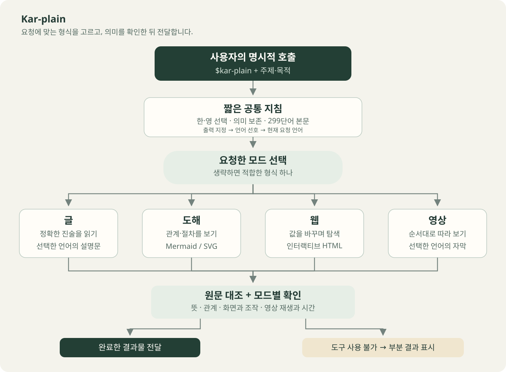
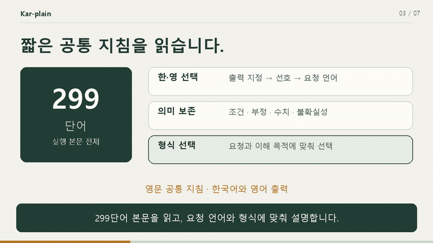

<p align="center">
  
</p>

<h1 align="center">Kar-plain<br>Choose the format that helps you understand.</h1>

<p align="center">
  A Codex skill for explaining topics through prose, diagrams, web pages and videos.<br>
  Invoke it when needed. Output is Korean by default.
</p>

<p align="center">
  Inspired by <a href="https://x.com/karpathy/status/2105819303471976479?s=20">Andrej Karpathy's original tweet</a>. An unofficial adaptation.
</p>

<p align="center">
  <a href="#installation"></a>
  <a href="#usage"></a>
  <a href="#how-it-works"></a>
  <a href="kar-plain/agents/openai.yaml"></a>
  <a href="kar-plain/SKILL.md"></a>
  <a href="LICENSE"></a>
</p>

<p align="center">
  <a href="README.md">한국어</a> · <strong>English</strong> ·
  <a href="#examples">Examples</a> · <a href="#installation">Installation</a> ·
  <a href="#usage">Usage</a> · <a href="#verified-scope">Verified scope</a>
</p>

After installation, give Codex a topic and a format.

```text
$kar-plain diagram: Explain how this skill works.
```

## Examples

We used this skill to explain the skill itself in four formats. All linked artifacts are in Korean; this English README describes the same outputs.

| Format | What to inspect | Artifact |
| --- | --- | --- |
| Prose | Purpose, invocation and meaning preservation | [Article](outputs/article.txt) |
| Diagram | Invocation, format selection, verification and completion | [SVG](outputs/diagram.svg) · [Mermaid source](outputs/diagram.mmd) |
| Web | The command changes as you select a purpose or edit a topic | [Self-contained HTML](outputs/index.html) |
| Video | Formats and completion criteria explained in sequence | [60-second MP4](outputs/kar-plain.mp4) · [SRT captions](outputs/kar-plain.srt) |

### Read the prose

> Kar-plain은 Codex에서 주제를 한국어로 설명할 때 쓰는 스킬이다. 정확한 내용을 읽어야 하면 글을 쓰고, 관계를 봐야 하면 도해를 만든다. 값을 바꾸며 살펴볼 때는 웹을, 순서대로 따라 볼 때는 영상을 선택한다.

This Korean excerpt describes the choice of prose for precise statements, diagrams for relationships, web pages for experimentation and video for sequential viewing. [Read the full article](outputs/article.txt).

### Inspect the diagram

<p align="center">
  <a href="outputs/diagram.svg"></a>
</p>

### Try the web example

[](outputs/index.html)

Download `index.html` and open it in a browser. Changing the purpose or topic updates the suggested format and command. This example demonstrates format selection. Paste the displayed command into Codex to generate an explanation. The diagram and video are embedded in the HTML file.

### Watch the video

[](outputs/kar-plain.mp4)

The image shows an 18-second excerpt. Download and play the [full 60-second MP4](outputs/kar-plain.mp4). The video is 1280×720 at 24fps, with Korean captions burned into the frames. It has no voice narration.

## Installation

1. Download and extract the repository.
2. Copy the `kar-plain` folder into your personal Codex skills directory. The current [official guide](https://learn.chatgpt.com/docs/build-skills) uses `~/.agents/skills`, or `%USERPROFILE%\.agents\skills` on Windows.
3. Invoke `$kar-plain` in Codex. Restart Codex if the new skill does not appear.

```text
~/.agents/skills/
└── kar-plain/
    ├── SKILL.md
    └── agents/openai.yaml
```

If your Codex environment provides a different personal skills directory, use that location. Install the two files shown above. Keep the README, banner and example artifacts outside the installed skill folder.

Installing the skill requires no separate API key or Python installation. Tools needed to produce web pages or videos depend on the task.

## Usage

| Need | Example invocation |
| --- | --- |
| Read precise statements | `$kar-plain prose: Explain the conditions and exceptions in this notice.` |
| See relationships and steps | `$kar-plain diagram: Show the branches and exceptions in this process.` |
| Explore by changing values | `$kar-plain web: Create an HTML explainer with adjustable interest rate and duration for compound interest.` |
| Watch a sequence | `$kar-plain video: Create a 60-second video of this process with Korean captions.` |
| Let the skill choose | `$kar-plain auto: Explain the following topic clearly.` |

Without a mode, the skill chooses one format suited to the request. Ask for multiple formats when you need them. Request voice narration or English output explicitly.

## How it works

The core instruction body contains 287 English words. When Codex selects the skill, it reads the full `SKILL.md` body and applies the requested format. `allow_implicit_invocation: false` keeps invocation explicit. [Official Codex guide](https://learn.chatgpt.com/docs/build-skills).

Every format preserves conditions, negation, quantities, obligations and uncertainty. Added examples and assumptions remain distinct from source facts. Prose uses ASD-STE100-inspired clarity while keeping Korean natural; it does not claim compliance with the standard.

Diagrams are checked for relationships and direction, web pages for their primary interaction, and videos for playback and scene timing. A request for a finished video requires a playable file. If required tools are unavailable, the skill identifies the blocker and labels partial results.

## Verified scope

We checked the skill structure and produced the four artifacts above. Web checks covered all four format buttons, topic editing, empty input and mobile layout. The video passed full-file decoding and browser playback checks.

These checks cover this production example. They do not establish explanation quality for other topics or compatibility with every environment. The READMEs were rendered and reviewed locally and on GitHub. [Verification record](docs/verification.md).

## License

[MIT License](LICENSE) · Copyright (c) 2026 Burntgogi

## Sources and documents

This skill was inspired by [Andrej Karpathy's original tweet](https://x.com/karpathy/status/2105819303471976479?s=20). It is an unofficial adaptation of his suggestion to help people understand through prose, diagrams, web pages and videos, applied to Korean Codex workflows.

The banner, centered introduction, badges, language switch and example placement draw on [AI Slop Thresher](https://github.com/Burntgogi/ai-slop-thresher). The banner and documents were created for this repository.

[Skill instructions](kar-plain/SKILL.md) · [Invocation settings](kar-plain/agents/openai.yaml) · [README design and references](docs/readme-design.md)
