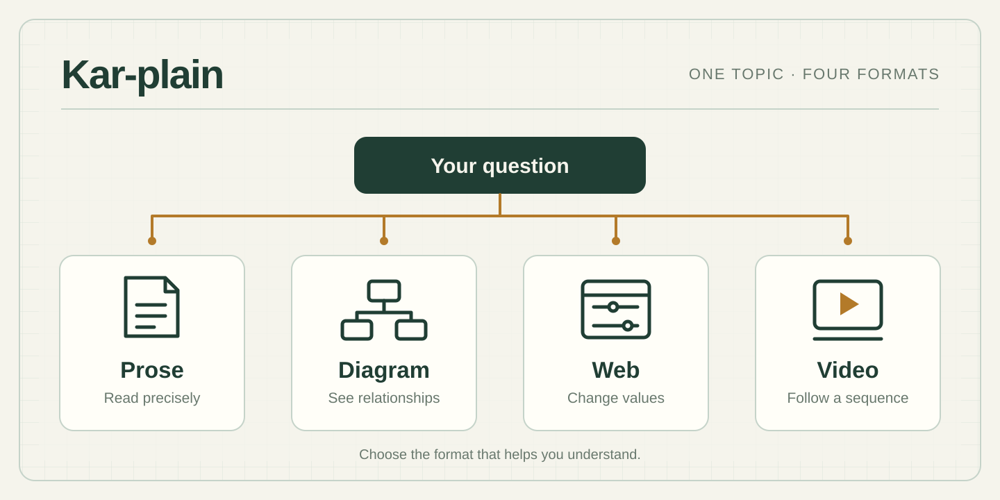
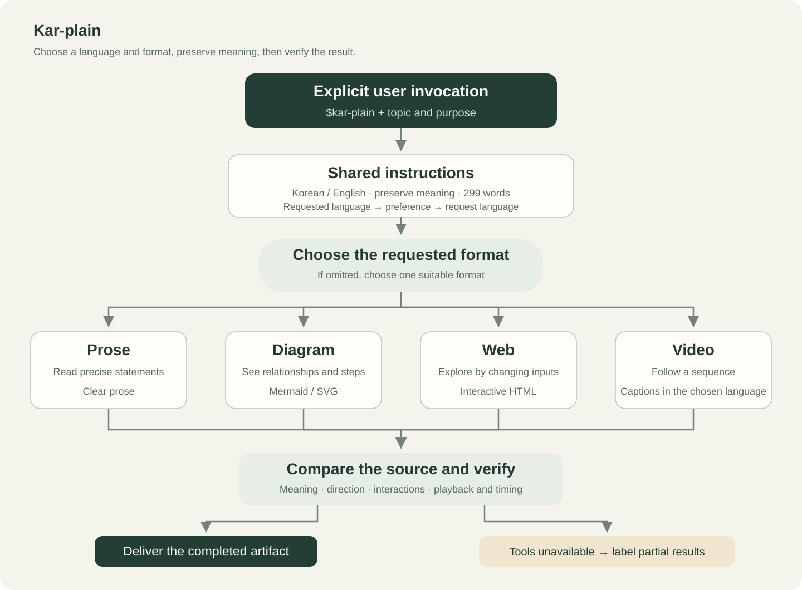
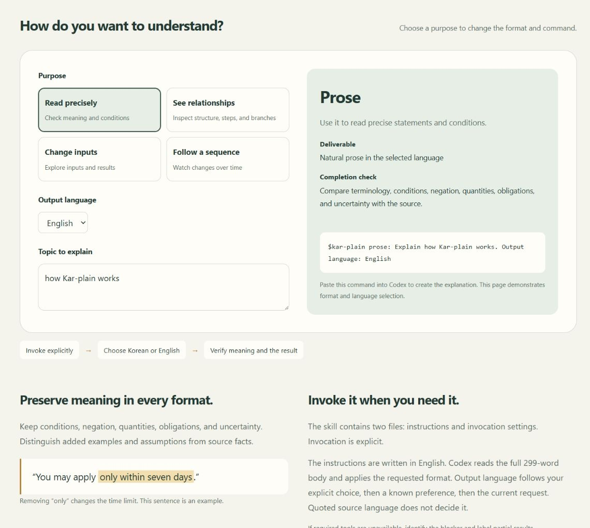
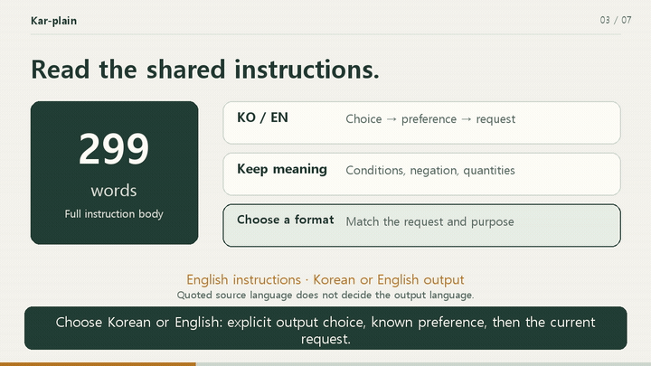

<p align="center">
  
</p>

<h1 align="center">Kar-plain<br>Choose the format that helps you understand.</h1>

<p align="center">
  A Claude Code and Codex skill for explaining topics through prose, diagrams, web pages and videos.<br>
  Invoke it when needed. Choose Korean or English output.
</p>

<p align="center">
  Inspired by <a href="https://x.com/karpathy/status/2105819303471976479?s=20">Andrej Karpathy's original tweet</a>. An unofficial adaptation.
</p>

<p align="center">
  <a href="#installation"></a>
  <a href="#usage"></a>
  <a href="#how-it-works"></a>
  <a href="plugins/kar-plain/skills/kar-plain/agents/openai.yaml"></a>
  <a href="plugins/kar-plain/skills/kar-plain/SKILL.md"></a>
  <a href="LICENSE"></a>
</p>

<p align="center">
  <a href="README.md">한국어</a> · <strong>English</strong> ·
  <a href="#examples">Examples</a> · <a href="#installation">Installation</a> ·
  <a href="#usage">Usage</a> · <a href="#verified-scope">Verified scope</a>
</p>

After installation, give Claude Code or Codex a topic and a format. In Codex, invoke it as `$kar-plain`.

```text
/kar-plain diagram: Explain how this skill works.
```

## Examples

We used this skill to explain the skill itself in four formats. The examples below are in English. Separate [Korean examples](README.md#예시) are also available.

The four-format examples below were produced with the earlier 299-word instruction body. The [prose comparison record](docs/prose-comparison.txt) contains the A/B/C results and analysis in Korean, with unchanged Korean and English samples. See [SKILL.md](plugins/kar-plain/skills/kar-plain/SKILL.md) for the current instructions. Invocations shown in the examples use the manual installation form.

| Format | What to inspect | Artifact |
| --- | --- | --- |
| Prose | Purpose, invocation and meaning preservation | [Article](outputs/en/article.txt) |
| Diagram | Invocation, format selection, verification and completion | [SVG](outputs/en/diagram.svg) · [Mermaid source](outputs/en/diagram.mmd) |
| Web | The command changes with the purpose, output language, or topic | [Self-contained HTML](outputs/en/index.html) |
| Video | Formats and completion criteria explained in sequence | [60-second MP4](outputs/en/kar-plain.mp4) · [SRT captions](outputs/en/kar-plain.srt) |

### Read the prose

> Kar-plain is a Codex skill that explains a topic in Korean or English. Use prose to read precise statements, a diagram to see relationships, a web page to explore by changing inputs, or a video to follow a sequence.

[Read the full article](outputs/en/article.txt).

### Inspect the diagram

<p align="center">
  <a href="outputs/en/diagram.svg"></a>
</p>

### Try the web example

[](outputs/en/index.html)

Download `index.html` and open it in a browser. Changing the purpose, output language, or topic updates the suggested format and command. This example demonstrates format selection. Paste the displayed command into Codex to generate an explanation. The diagram and video are embedded in the HTML file.

### Watch the video

[](outputs/en/kar-plain.mp4)

The image shows an 18-second excerpt. Download and play the [full 60-second MP4](outputs/en/kar-plain.mp4). The video is 1280×720 at 24fps, with English captions burned into the frames. It has no voice narration.

## Installation

The skill runs in both Claude Code and Codex. Installing it as a plugin gives you one command to install and one to update.

### Claude Code

Run these commands inside a Claude Code session.

```text
/plugin marketplace add dovigod/kar-plain
/plugin install kar-plain@kar-plain
```

Invoke it as `/kar-plain:kar-plain`.

### Codex

```bash
codex plugin marketplace add dovigod/kar-plain --ref main
codex plugin add kar-plain@kar-plain
```

Invoke it as `$kar-plain:kar-plain`.

### Manual installation

Download the repository and copy the `plugins/kar-plain/skills/kar-plain` folder into your personal skills directory. This method keeps the short form, `/kar-plain` or `$kar-plain`.

```text
~/.claude/skills/     (Claude Code)
~/.agents/skills/     (Codex, or %USERPROFILE%\.agents\skills on Windows)
└── kar-plain/
    ├── SKILL.md
    └── agents/openai.yaml
```

Install the two files shown above. Keep the README, banner and example artifacts outside the installed skill folder. If your client provides a different personal skills directory, use that location. Restart the client if the new skill does not appear.

Installing the skill requires no separate API key or Python installation. Tools needed to produce web pages or videos depend on the task.

## Usage

| Need | Example invocation |
| --- | --- |
| Read precise statements | `$kar-plain prose: Explain the conditions and exceptions in this notice.` |
| See relationships and steps | `$kar-plain diagram: Show the branches and exceptions in this process.` |
| Explore by changing values | `$kar-plain web: Create an HTML explainer with adjustable interest rate and duration for compound interest.` |
| Watch a sequence | `$kar-plain video: Create a 60-second video of this process with English captions.` |
| Let the skill choose | `$kar-plain auto: Explain the following topic clearly.` |

The invocations above use the manual installation form. With the plugin installed, prefix the skill name with `kar-plain:`, for example `/kar-plain:kar-plain prose: ...`.

Without a mode, the skill chooses one format suited to the request. Ask for multiple formats when you need them. Output language follows an explicit choice, then a known user language preference, then the current request. Quoted source language does not decide it. You can request Korean output in English. Ask for voice narration when you need it.

```text
$kar-plain diagram: Explain this process in Korean.
```

## How it works

The core instruction body contains 308 English words. In both hosts, selecting the skill reads the full `SKILL.md` body and applies the requested format. The explicit-invocation policy is recorded in two host settings: `allow_implicit_invocation: false` for Codex and `disable-model-invocation: true` for Claude Code. [Official Codex guide](https://learn.chatgpt.com/docs/build-skills) · [Official Claude Code guide](https://code.claude.com/docs/en/skills).

Every format preserves conditions, negation, quantities, obligations and uncertainty. Added examples and assumptions remain distinct from source facts. English procedures and technical descriptions use ASD-STE100 as a writing reference. Korean and other English prose use STE-inspired clarity. Prose explains jargon, preserves claim strength and logical links, and separates procedural actions. It stays natural in the selected language without claiming verified compliance.

Diagrams are checked for relationships and direction, web pages for their primary interaction, and videos for playback and scene timing. A request for a finished video requires a playable file. If required tools are unavailable, the skill identifies the blocker and labels partial results.

## Verified scope

We checked the skill structure and produced separate Korean and English examples in all four formats. Web checks covered all four format buttons, language selection, topic editing, empty input and mobile layout. Both videos passed full-file decoding and browser playback checks.

We compared 24 outputs in each of two prompt-blinded rounds. The first C was not selected; a revised C2 was compared with the unchanged A/B outputs before choosing the final directive. There are 32 distinct outputs in total. Review used separate agents for source fidelity and linguistic comparison, not a human comprehension study.

These checks cover this production example. They do not establish explanation quality for other topics or compatibility with every environment. The READMEs were rendered and reviewed locally and on GitHub. [Verification record](docs/verification.md).

## License

[MIT License](LICENSE) · Copyright (c) 2026 Burntgogi

## Sources and documents

This skill was inspired by [Andrej Karpathy's original tweet](https://x.com/karpathy/status/2105819303471976479?s=20). It is an unofficial adaptation of his suggestion to help people understand through prose, diagrams, web pages and videos, applied to Korean and English Codex workflows.

The banner, centered introduction, badges, language switch and example placement draw on [AI Slop Thresher](https://github.com/Burntgogi/ai-slop-thresher). The banner and documents were created for this repository.

[Skill instructions](plugins/kar-plain/skills/kar-plain/SKILL.md) · [Invocation settings](plugins/kar-plain/skills/kar-plain/agents/openai.yaml) · [README design and references](docs/readme-design.md)
